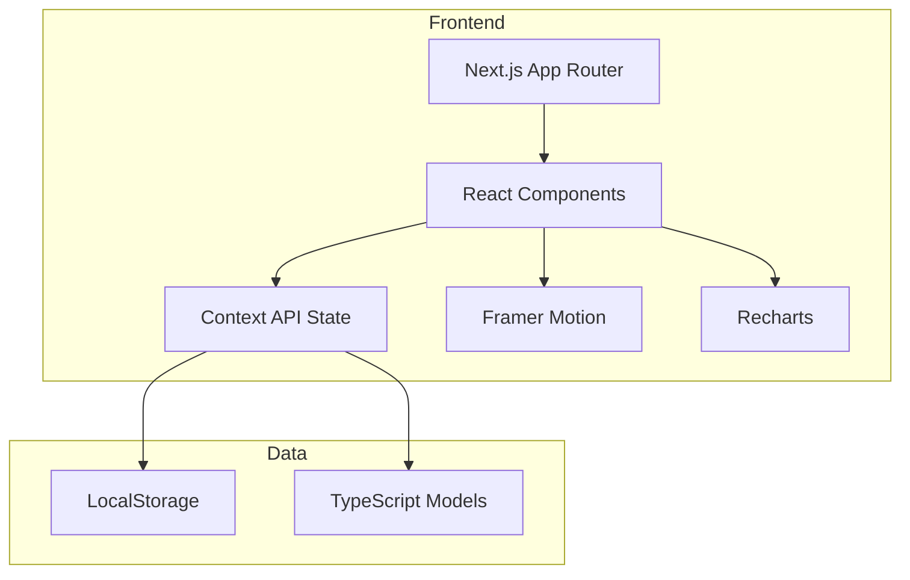
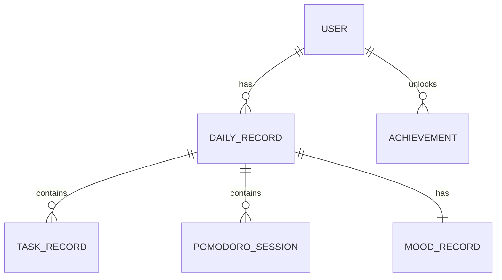

## 1. Architecture Design


## 2. Technology Description
- **Frontend**: Next.js 14 (App Router) + React 18 + TypeScript
- **Styling**: Tailwind CSS v4 + shadcn/ui components
- **State Management**: React Context API
- **Charts**: Recharts
- **Animations**: Framer Motion
- **Icons**: Lucide React
- **Storage**: Browser LocalStorage (client-side only)
- **Initialization**: Next.js create-next-app

## 3. Route Definitions
| Route | Purpose |
|-------|---------|
| / | 首页 - 心情选择、任务打卡、今日统计 |
| /stats | 统计页 - 趋势图、分布图、成就 |
| /focus | 专注页 - 番茄钟计时器 |
| /profile | 个人页 - 用户信息、设置、数据管理 |

## 4. Data Model

### 4.1 Data Model Definition


### 4.2 TypeScript Type Definitions

```typescript
// lib/types.ts

// 用户信息
interface User {
  id: string;
  name: string;
  avatar?: string;
  createdAt: string;
}

// 任务类型
interface TaskType {
  id: number;
  name: string;
  icon: string;
  color: string;
  defaultDuration: number;
}

// 任务记录
interface TaskRecord {
  id: string;
  type: number;
  completed: boolean;
  duration: number;
  notes?: string;
  tags: string[];
  completedAt: string;
}

// 心情类型
type Mood = '😊' | '😐' | '😢' | '🤩' | '😴';

// 心情记录
interface MoodRecord {
  date: string;
  mood: Mood;
  note?: string;
}

// 番茄钟记录
interface PomodoroSession {
  id: string;
  duration: number;
  taskType?: number;
  completedAt: string;
}

// 每日记录
interface DailyRecord {
  date: string;
  tasks: TaskRecord[];
  mood?: MoodRecord;
  pomodoroSessions: PomodoroSession[];
  dailyNotes?: string;
}

// 成就
interface Achievement {
  id: number;
  name: string;
  description: string;
  icon: string;
  unlocked: boolean;
  unlockedAt?: string;
}

// 应用状态
interface AppData {
  user: User;
  taskTypes: TaskType[];
  dailyRecords: DailyRecord[];
  achievements: Achievement[];
}
```

## 5. Project Structure
```
growth-tracker-next/
├── app/
│   ├── layout.tsx           # 根布局
│   ├── page.tsx             # 首页
│   ├── stats/
│   │   └── page.tsx         # 统计页
│   ├── focus/
│   │   └── page.tsx         # 专注页
│   └── profile/
│       └── page.tsx         # 个人页
├── components/
│   ├── ui/                  # shadcn/ui 组件
│   ├── layout/
│   │   ├── BottomNav.tsx    # 底部导航
│   │   └── PageContainer.tsx
│   ├── features/
│   │   ├── TaskCard.tsx
│   │   ├── TaskConfigModal.tsx  # 任务配置弹窗（添加/编辑/删除任务类型）
│   │   ├── MoodTracker.tsx
│   │   ├── PomodoroTimer.tsx
│   │   ├── StatCard.tsx
│   │   ├── AchievementCard.tsx
│   │   └── HistoryList.tsx
│   └── charts/
│       ├── TrendChart.tsx
│       └── DistributionChart.tsx
├── lib/
│   ├── storage.ts           # 数据管理
│   ├── migration.ts         # 旧数据迁移
│   ├── types.ts             # 类型定义
│   ├── constants.ts         # 常量
│   └── utils.ts
├── hooks/
│   ├── useStorage.ts
│   ├── usePomodoro.ts
│   ├── useMood.ts
│   ├── useWhiteNoise.ts       # 白噪音生成（Web Audio API）
│   └── useTheme.tsx          # 主题切换管理
├── public/
├── package.json
├── tsconfig.json
├── tailwind.config.ts
└── next.config.ts
```

## 6. State Management

### AppContext
使用 React Context API 管理全局状态：
```typescript
interface AppContextType {
  data: AppData;
  addTaskRecord: (date: string, task: Omit<TaskRecord, 'id' | 'completedAt'>) => void;
  saveMood: (date: string, mood: Mood, note?: string) => void;
  addPomodoroSession: (session: Omit<PomodoroSession, 'id' | 'completedAt'>) => void;
  saveDailyNotes: (date: string, notes: string) => void;
  updateTaskType: (id: number, updates: Partial<TaskType>) => void;  // 更新任务类型
  addTaskType: (task: Omit<TaskType, 'id'>) => void;                  // 添加新任务类型
  deleteTaskType: (id: number) => void;                                // 删除任务类型
  exportData: () => void;
  importData: (data: AppData) => void;
  resetData: () => void;
}
```

### Custom Hooks
- `useStorage()`: 数据存取与持久化
- `usePomodoro()`: 番茄钟计时器逻辑
- `useMood()`: 心情选择与追踪
- `useWhiteNoise()`: 白噪音音频生成和控制，支持5种音效类型（白噪音、粉红噪音、雨声、咖啡馆、森林）
- `useTheme()`: 主题切换管理，支持日间/夜间模式，本地存储持久化

## 7. Data Migration

### Legacy Data Format
- Key: `growthTrackerData`
- Auto-detect on first launch and migrate to new format `growthTrackerNextData`

### Default Data
```typescript
const DEFAULT_TASK_TYPES: TaskType[] = [
  { id: 1, name: '读书', icon: '📚', color: '#667eea', defaultDuration: 60 },
  { id: 2, name: 'Vibe Coding', icon: '💻', color: '#764ba2', defaultDuration: 90 },
  { id: 3, name: '健身', icon: '🏋️', color: '#f093fb', defaultDuration: 45 },
  { id: 4, name: '写自媒体', icon: '📱', color: '#4facfe', defaultDuration: 60 },
  { id: 5, name: '其他', icon: '⭐', color: '#fa709a', defaultDuration: 30 },
];

const DEFAULT_ACHIEVEMENTS: Achievement[] = [
  { id: 1, name: '新手上路', description: '完成首次打卡', icon: '🎯', unlocked: false },
  { id: 2, name: '坚持一周', description: '连续打卡7天', icon: '🔥', unlocked: false },
  { id: 3, name: '月度达人', description: '完成30天打卡', icon: '🏆', unlocked: false },
  { id: 4, name: '知识渊博', description: '读书任务完成50次', icon: '📖', unlocked: false },
  { id: 5, name: '代码大师', description: 'Vibe Coding完成100小时', icon: '👨‍💻', unlocked: false },
  { id: 6, name: '专注达人', description: '完成100个番茄钟', icon: '⏱️', unlocked: false },
];
```
