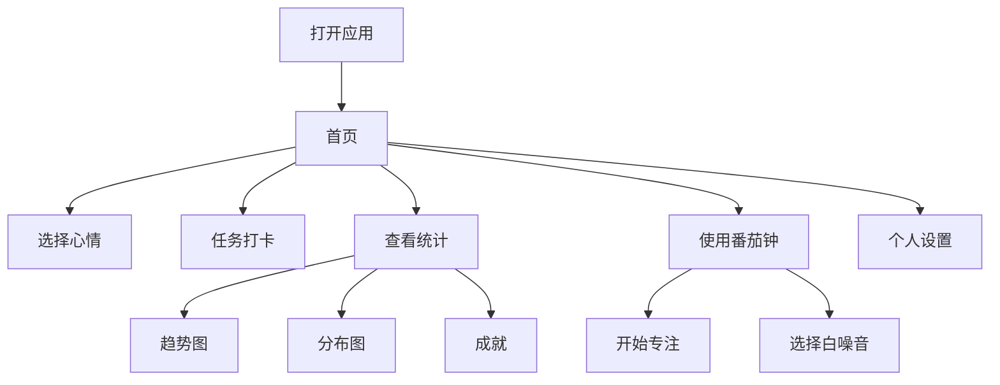

## 1. Product Overview
Growth Tracker 是一个个人成长陪伴工具，帮助用户记录日常任务打卡、追踪专注时长、记录心情，并通过数据可视化展示成长历程。
- 主要面向有自我提升需求的用户，提供任务管理、番茄钟、心情追踪和统计分析功能
- 目标是让用户直观地看到自己的进步，保持持续成长的动力

## 2. Core Features

### 2.1 User Roles
| Role | Registration Method | Core Permissions |
|------|---------------------|------------------|
| Normal User | Local storage (no registration) | Full access to all features |

### 2.2 Feature Module
1. **首页 (Dashboard)**: 心情选择、快捷任务打卡、今日统计、最近记录
2. **统计页 (Stats)**: 任务趋势图、任务分布图、成就展示
3. **专注页 (Focus)**: 番茄钟计时器、白噪音、专注历史
4. **个人页 (Profile)**: 用户信息、主题切换、数据导入导出

### 2.3 Page Details
| Page Name | Module Name | Feature description |
|-----------|-------------|---------------------|
| 首页 | 心情选择 | 5个表情按钮快速记录今日心情，带视觉反馈动画 |
| 首页 | 快捷任务卡片 | 2x2网格布局的任务卡片，点击完成打卡，显示完成状态，可通过配置按钮添加/编辑/删除任务类型 |
| 首页 | 今日统计 | 显示今日任务数、完成数、连续打卡天数 |
| 首页 | 浮动按钮 | 右下角快速进入番茄钟专注模式 |
| 统计页 | 趋势图 | 周/月/年切换的任务完成趋势折线图 |
| 统计页 | 分布图 | 饼图展示各任务类型完成比例 |
| 统计页 | 成就卡片 | 横向滚动的成就列表，显示解锁状态 |
| 统计页 | 日历选择 | 支持按日历选择任意日期，查看当天的打卡和心情记录，默认显示今日数据 |
| 专注页 | 番茄钟计时器 | 大数字显示倒计时，进度环动画，开始/暂停/重置控制 |
| 专注页 | 白噪音 | 雨声、咖啡馆、白噪音、粉红噪音、森林音效，使用Web Audio API合成生成，无需外部音频文件 |
| 个人页 | 主题切换 | 支持日间（浅色）和夜间（深色）模式切换，设置保存到本地存储 |
| 个人页 | 数据管理 | 导出、导入、重置数据功能 |

## 3. Core Process
用户打开应用后，首先看到首页，可以选择今日心情，然后点击任务卡片完成打卡。通过底部导航栏可以切换到统计页查看数据，到专注页使用番茄钟，到个人页管理设置。数据全部存储在本地，支持导出备份。

## 4. User Interface Design
### 4.1 Design Style
- **Primary colors**: 柔和的紫色渐变 (#667eea → #764ba2)，搭配清新的青色 (#4facfe)
- **Button style**: 大圆角卡片按钮，带轻微阴影和悬停上浮效果
- **Fonts**: 现代无衬线字体，标题使用稍粗字重，正文保持良好可读性
- **Layout style**: 移动端优先的卡片式布局，底部导航栏
- **Icon style**: Lucide React 线性图标，搭配 emoji 增加亲和力

### 4.2 Page Design Overview
| Page Name | Module Name | UI Elements |
|-----------|-------------|-------------|
| 首页 | 心情选择 | 水平排列的表情按钮，选中态放大高亮 |
| 首页 | 任务卡片 | 2x2网格，彩色图标+文字，完成态半透明 |
| 统计页 | 图表区域 | 响应式 Recharts 图表，简洁配色 |
| 专注页 | 计时器 | 居中的大数字，圆形进度环 |
| 个人页 | 设置列表 | 分组卡片式设置项 |

### 4.3 Responsiveness
移动端优先设计，适配手机、平板和桌面端，底部导航在大屏可转为侧边栏。

### 4.4 Animations
- 页面切换使用 Framer Motion 淡入淡出 + 滑动效果
- 任务完成有庆祝动画
- 番茄钟进度环平滑过渡
- 心情选择有微动效反馈
